<h1 align="center">🚀 BLITE ACADEMY 🚀</h1>

O projeto BLITE ACADEMY se trata de uma pequena demonstração que fiz do site da Blite Academy voltado para a mulheres, então usei apenas modelos femininas para mostrar durante a entrevista, a fim de demonstrar minha proficiência e capacidade de correr atrás do que é necessário. Espero que gostem!! 😄😄

## :camera: Demonstração

  <h2 align="center">STEP 1</h2>
  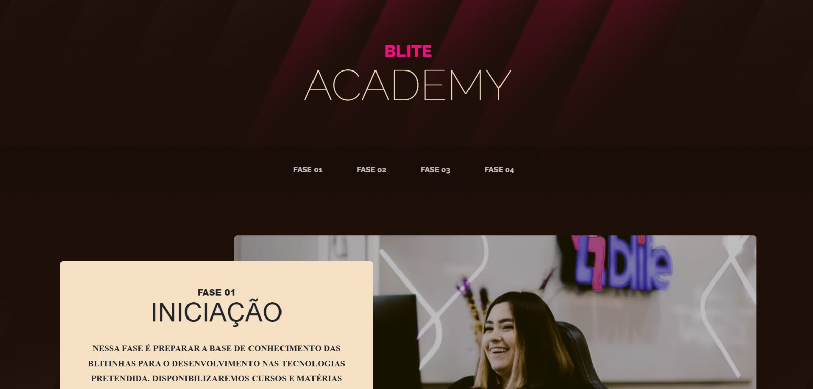
  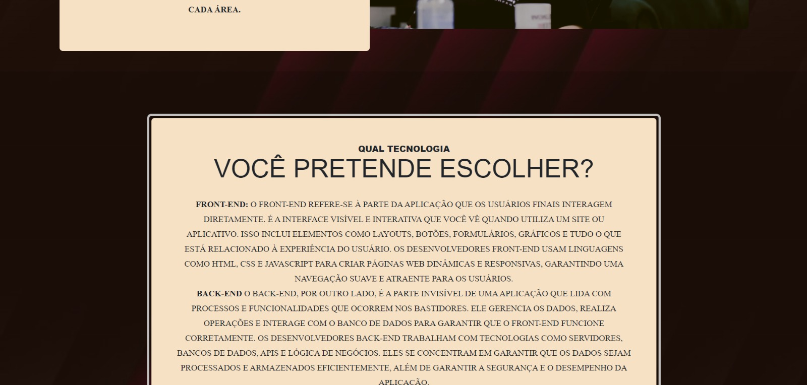
  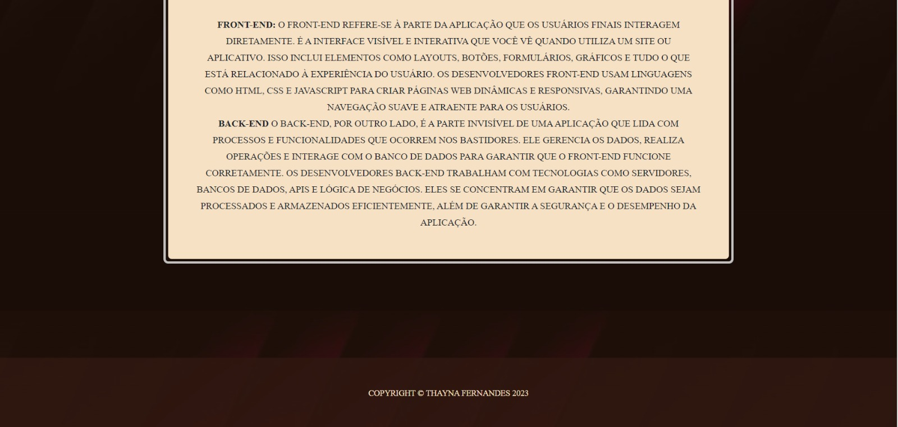  

  <h2 align="center">STEP 2</h2>
  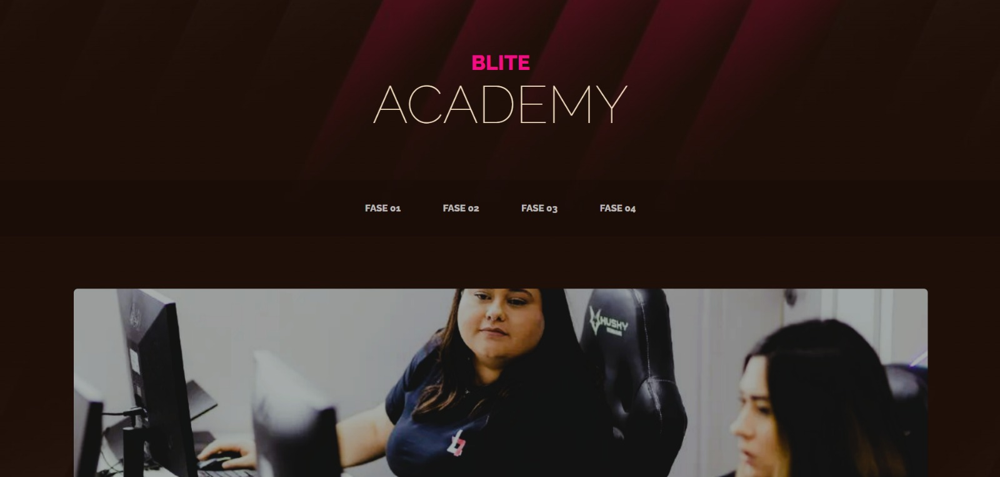
  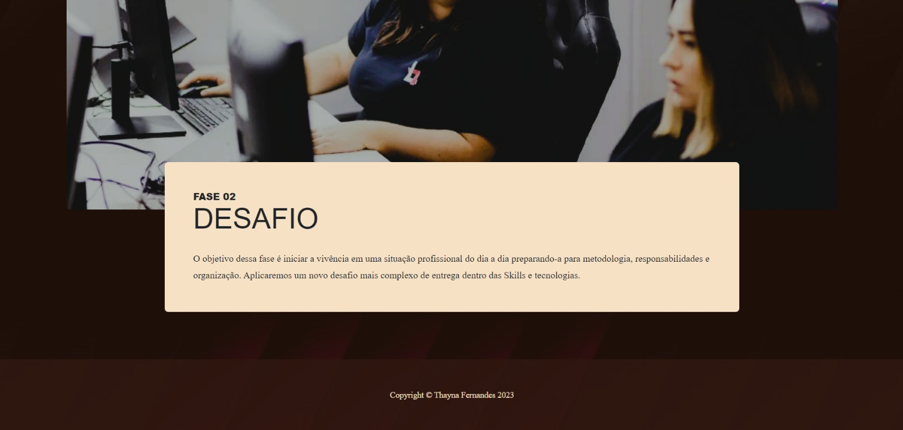  

  
  <h2 align="center">STEP 3</h2>
  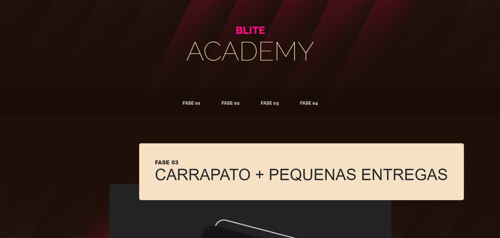
  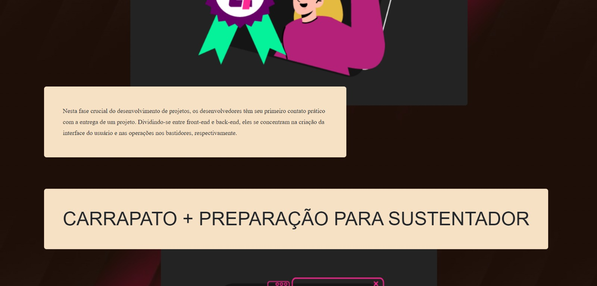
  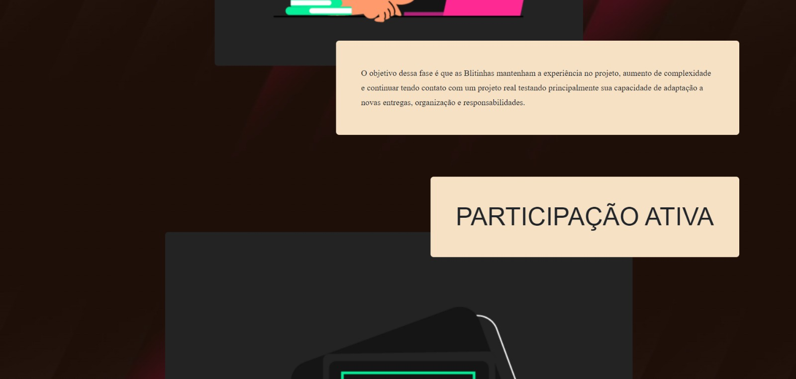
  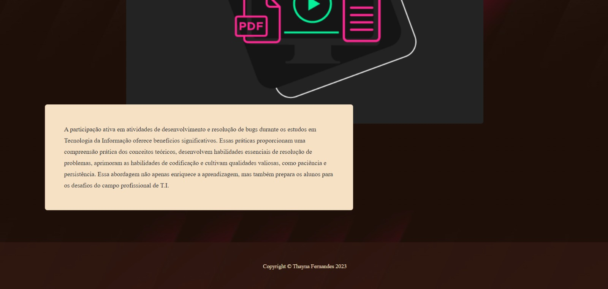  

  <h2 align="center">STEP 4</h2>
  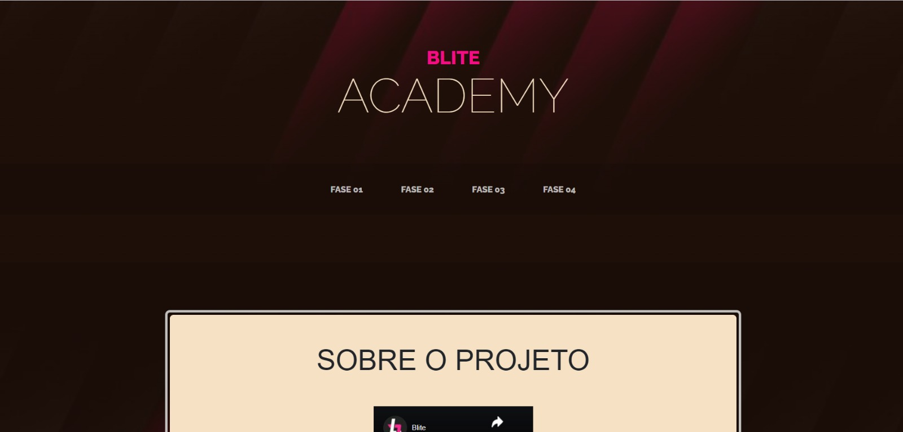
  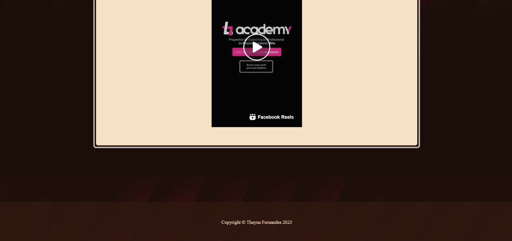 

 

# Funcionalidades

 - STEP 1 - Iniciação
 - STEP 2 - Desafio
 - STEP 3 - Carrapato + Pequenas Entregas e Participação Ativa
 - STEP 4 - Sobre o Projeto

## 🚀 Tecnologias

Este projeto foi desenvolvido com as seguintes tecnologias:

- ✔️ HTML5

- ✔️ CSS3

- ✔️ Git

## ⚙ Configuração para rodar o projeto localmente

1- Clonar o repositório na sua máquina
> git clone https://github.com/Thaynafxavier/blite-academy.git

2- Abrir o arquivo fase01.html no seu navegador

3- E pronto, você já pode testar o projeto localmente no seu navegador

Feito com 💜 por THAYNA FERNANDES 👋 [Veja meu Linkedin](https://www.linkedin.com/in/thaynafxavier/)
 
